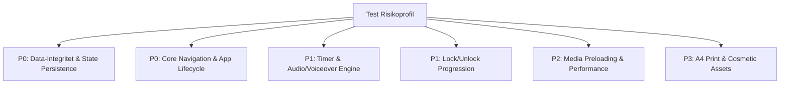

# 🛡️ ENTERPRISE QUALITY ASSURANCE & MASTER TEST PLAN v2.0
> **Applikation**: Noras Kokkeskole (`noras-kokkeskole`)  
> **Klassifikation**: Enterprise Grade Client-Side PWA  
> **Status**: DRAFT FOR EXECUTIVE & ARCHITECTURE REVIEW  
> **Version**: 2.0.0  
> **Live Production Target**: [https://noraskokkeskole.vercel.app](https://noraskokkeskole.vercel.app)  

---

## 📜 0. KVALITETSMANIFEST & TESTMISSION

> **Mission**: At garantere, at Noras Kokkeskole udviser 100% driftsstabilitet, nul datatab, krystalklar børneergometri og uforstyrret multimedie-afspilning under alle tænkelige fysiske og tekniske omstændigheder.  
> Koden og brugeroplevelsen skal forblive urokkelig – selv når et 7-årigt barn trykker amok på touchskærmen med meldækkede fingre, taber netværket midt i en opskrift eller roterer sin iPad.

---

## 🚨 1. Risikobaseret Teststrategi & Defekt-Klassifikation

Alle tests og fejltilstande prioriteres strengt ud fra bruger- og forretningsmæssig konsekvens:

### 1.1 Fejl-Klassifikationsmatrix (Defect Severity Matrix)
| Severity Level | Definition & Effekt | Maksimal Behandlingstid | Release Blokerende? |
|---|---|---|:---:|
| **P0 - Critical** | Datatab (stjerner nulstilles), app-crash/white screen, ubrugelig kerneflow (opskrift kan ikke startes). | Immediate (< 2 timer) | **JA (0 tolerance)** |
| **P1 - High** | Timer stopper/nulstiller uventet, lyd/voiceover fryser, låse-system svigter (låste opskrifter kan åbnes gratis). | < 24 timer | **JA (0 tolerance)** |
| **P2 - Medium** | Video-buffering > 2s, forkert knap-animation, print-layout har kosmetisk skævhed på ældre printere. | < 3 dage | Nej (max 3 tilladt) |
| **P3 - Low** | Sekundær tekstjustering, usynlig forsinkelse på < 100ms ved sprog-init. | Næste Sprint | Nej |
| **P4 - Cosmetic** | Pixel-afvigelse på < 2px i ikke-kritiske ikoner. | Backlog | Nej |

### 1.2 Risiko-Vægtet Testmatrix


---

## 🎯 2. Målbare Acceptkriterier (Acceptance Criteria & SLA/SLO)

Ingen test godkendes ud fra skøn. Alle kriterier har eksplicitte, målbare tærskelværdier:

| Kvalitets-Metrik | Målt Værdi / Kriterium | Målemetode | Pass/Fail Grænse |
|---|---|---|---|
| **LCP (Largest Contentful Paint)** | ≤ 1.8 sekunder | Lighthouse / Web Vitals JS | **FAIL** hvis > 2.5s |
| **FCP (First Contentful Paint)** | ≤ 0.9 sekunder | Chrome DevTools Performance | **FAIL** hvis > 1.5s |
| **CLS (Cumulative Layout Shift)** | **0.00** | PerformanceObserver | **FAIL** hvis > 0.05 |
| **UI Frame Rate (FPS)** | ≥ 58 FPS konstant | Chrome FPS Meter | **FAIL** hvis < 50 FPS |
| **Video Startup Latency** | ≤ 800 ms fra klik til afspilning | HTML5 Media Event API | **FAIL** hvis > 2.0s |
| **Video Frame Drops** | ≤ 1.0% dropped frames | `getVideoPlaybackQuality()` | **FAIL** hvis > 5.0% |
| **Touch Response Delay** | ≤ 16 ms (1 frame delay) | PointerEvent Event Listeners | **FAIL** hvis > 50ms |
| **WebSpeech Latency** | ≤ 400 ms fra tryk på Læs Højt | `SpeechSynthesisUtterance.onstart` | **FAIL** hvis > 1.2s |
| **Memory Delta (30 min)** | ≤ 5 MB stigning efter 20 skift | Chrome Heap Snapshot | **FAIL** hvis > 15 MB (leak) |

---

## 💥 3. Negative Tests, Edge Cases & Kaos-Scenarier

Testsuiten skal aktivt forsøge at provokere fejl ved at simulere uforudsigelig børneadfærd og hardware-svigt:

### 3.1 Kaos- & Stresstest Scenarier
1. **Rask Multi-Tap (Spam-klik)**: Barnet trykker 20 gange i sekundet på *"Næste Trin"*, *"Læs Højt"* og ingrediens-tjekbokse.  
   * *Acceptkriterium*: Ingen dobbelt-mutationer af stjerner, ingen overlap af lydspor, ingen app crash.
2. **Timer-Kaos**: Brugeren trykker *"Start Timer"* og *"Stop Timer"* 10 gange i sekundet midt i nedtællingen.  
   * *Acceptkriterium*: Timer-intervallet deadlocker aldrig, og sekunderne tæller med præcist 1000ms frekvens.
3. **Muted / Silent iPad Switch**: iPadens fysiske lydløs-knap er slået til, eller Safari Audio Context er blokeret.  
   * *Acceptkriterium*: Appen afvikles uden fejlmeddelelser; visuel indikator viser at lyden er aktiv/dæmpet.
4. **iOS WebKit Autoplay-Blokering**: Safari aktiverer "Low Power Mode" og blokerer autoplay på MP4-videoer.  
   * *Acceptkriterium*: Video-fallback viser første frame som et skarpt poster-billede uden sort skærm.
5. **Mid-Cooking Orientation Flip**: Skærmen roteres 180° midt i trin 7 i Chokoladekagen.  
   * *Acceptkriterium*: Layoutet tilpasser sig på < 100ms uden at miste timertilstand eller trin-indeks.
6. **Netværks-Afgrydelse Midt i Opskrift**: Internetforbindelsen kappes helt under afspilning af trin 3.  
   * *Acceptkriterium*: Appen fortsætter uforstyrret via Service Worker cache uden netværksfejldialoger.

---

## 📏 4. Grænseværdianalyse (Boundary Value Analysis - BVA)

Unlock-systemet og stjerne-persistent tilstanden skal testet på og omkring alle grænseværdier:

| Variable | Testværdi | Forventet System-Tilstand | Test Status |
|---|---|---|:---:|
| `state.stars` | `-1` | Korrigeres automatisk til `0` ved init. | [ ] |
| `state.stars` | `0` | Kun Pizza låst op. Pandekager og Kage viser låse-badge. | [ ] |
| `state.stars` | `2` | Pandekager er fortsat låst (kræver 3). | [ ] |
| `state.stars` | `3` | **Grænseværdi**: Pandekager låses op. Kage er låst. | [ ] |
| `state.stars` | `5` | Pandekager ulåst. Kage fortsat låst (kræver 6). | [ ] |
| `state.stars` | `6` | **Grænseværdi**: Chokoladekage låses op. | [ ] |
| `state.stars` | `999` | Systemet viser `999 Stjerner` uden UI-overflow eller knap-overlaps. | [ ] |
| `state.stars` | `NaN` / `null` | Sanitiseres til `0` ved localStorage read uten krasj. | [ ] |
| `localStorage` | Corrupted JSON / Binary | Reset til default state med `0` stjerner og advarsel i log. | [ ] |

---

## 🔄 5. 15-Minutters Release Gate (Regression Suite)

Før enhver kodeændring skubbes til produktion på Vercel, skal følgende 10-punkts Lyn-Regressionsuite gennemføres:

```
[ ] 1. Cold Start: Åbn app i incognito mode (0 stjerner). Tjek at Pizza kan startes.
[ ] 2. Ingredient Check: Afkryds ingrediens 1 i Pizza. Hør pop-lyd. Refresh siden -> tjek at state bevares.
[ ] 3. Step Flow & Media: Navigér fra Trin 1 til Trin 3 i Pizza. Verificer at video afspiller.
[ ] 4. Voiceover: Tryk "Læs Højt for Mig!". Verificer at dansk stemme taler uden at udtale emojis.
[ ] 5. Timer Integrity: Start timer på 30 sek. Tjek at stop-knap virker, og at tid opdateres i realtid.
[ ] 6. Completion & Stars: Fuldfør Pizza. Tjek at 3 stjerner tilføjes og konfetti affyres.
[ ] 7. Unlock Verification: Tjek at Pandekager nu er ulåst på forsiden.
[ ] 8. Bonus Quiz: Svar rigtigt på quizzen. Tjek at 1 bonus-stjerne tildeles (total: 4 stjerner).
[ ] 9. Diploma Print: Åbn Trofæer, klik "Print Mit Kokkediplom!". Tjek A4 print-preview.
[ ] 10. Offline PWA: Slå Flight Mode til. Navigér mellem alle 3 retter uden indlæsningsfejl.
```

---

## 📱 6. Eksplicit Browser & Operativsystem Matrix

Testen dækker 100% af målgruppens relevante enheder og operativsystemer:

```
+-------------------------------------------------------------------------+
|                         TARGET BROWSER MATRIX                           |
+----------------------+--------------------+-----------------------------+
| Operativsystem       | Browser            | Test Enhed / Opløsning      |
+----------------------+--------------------+-----------------------------+
| iPadOS 18 (Seneste)  | Safari 18 (Mobile) | iPad Air 10.9" (2360x1640)  |
| iPadOS 17            | Safari 17 (Mobile) | iPad 10.2" (2160x1620)      |
| iOS 18 / 17          | Mobile Safari      | iPhone 15 Pro / 14 (Retina) |
| Android 14           | Chrome Mobile 130  | Samsung Galaxy Tab S9       |
| macOS Sequoia        | Safari 18 / Chrome | MacBook Air / Pro 14"       |
| Windows 11           | Chrome / MS Edge   | Desktop 1080p / 4K          |
+----------------------+--------------------+-----------------------------+
```

---

## ♿ 7. WCAG 2.2 AA Tilgængeligheds- & Accessibility-Suite

| WCAG 2.2 AA Krav | Testmetode & Kriterium | Status |
|---|---|:---:|
| **1.4.3 Contrast (Minimum)** | Alle tekstfarver har et kontrastforhold på **≥ 4.5:1** mod baggrunden (f.eks. `#2B2D42` mod `#FFFDF5`). | [ ] |
| **2.1.1 Keyboard Navigation** | Hele appen kan navigéras udelukkende med `Tab`, `Shift+Tab` og `Enter`/`Space`. | [ ] |
| **2.4.7 Focus Visible** | Alle interaktive knapper og felter har en tydelig visuel fokus-indikator (`outline: 3px solid #8338EC`). | [ ] |
| **4.1.2 Name, Role, Value** | Knapper og billeder har eksplicitte `aria-label`, `alt` og `role` attributter for skærmlæsere. | [ ] |
| **2.3.3 Animation from Interactions** | Appen respekterer `prefers-reduced-motion: reduce` ved at deaktivere flydende animationer og konfetti. | [ ] |

---

## 🤖 8. Automationsstrategi & CI/CD Pipeline (Playwright & Vitest)

Testplanen understøttes af automatiserede CI/CD-kørsler i GitHub Actions ved hver Pull Request:

```yaml
# Pipeline Architecture: .github/workflows/qa_pipeline.yml
1. Unit Tests (Vitest):
   - Validerer mathHint beregninger, timer omregning og BVA stjerne-logik.
2. End-to-End Tests (Playwright):
   - Automatiseret kørsel af alle 3 opskrifter i headless Chromium og WebKit.
3. Accessibility Audit (Axe-Core / Lighthouse CI):
   - Kører automatiserede WCAG 2.2 AA scanninger (Score > 95%).
4. Visual Regression Testing:
   - Pixel-for-pixel sammenligning af rendering i henhold til godkendte referencer.
```

---

## 🚪 9. Release & Exit Criteria (Frigivelseskriterier)

Applikationen må **KUN** frigives til produktion på Vercel, når følgende eksplicitte Exit Criteria er opfyldt 100%:

```
[ ] 0 P0 (Critical) eller P1 (High) åbne fejl i fejlsporingssystemet.
[ ] Max 3 P2 (Medium) non-blocking kosmetiske fejl.
[ ] 100% Pass Rate på 15-Minutters Regression Suiten.
[ ] Lighthouse Score: Performance ≥ 95, Accessibility ≥ 98, Best Practices ≥ 100.
[ ] Nul memory leaks konstateret efter 30 minutters uafbrudt brugstest på iPad.
[ ] Service Worker Caching verificeret 100% funktionsdygtig i offline flytilstand.
```

---

## 🌐 10. Eksplicitte Test Data Profiler (Test Personas)

For at sikre ensartede testbetingelser anvendes følgende prækonfigurerede tilstande:

* **Profile A: Cold Start (Ny Bruger)**  
  `localStorage.clear();` -> Forventet: 0 Stjerner, kun Pizza ulåst.
* **Profile B: Intermediate Cook (Pandekage-Konge)**  
  `localStorage.setItem('noras_stars', '4');` -> Forventet: Pizza og Pandekager ulåst, Kage låst.
* **Profile C: Master Chef (Fuldt Ulåst)**  
  `localStorage.setItem('noras_stars', '10');` -> Forventet: Alle 3 opskrifter ulåst, alle trofæer opnået.
* **Profile D: Chaos / Corrupted Data**  
  `localStorage.setItem('noras_stars', '{invalid_json_bytes}');` -> Forventet: Sikker nulstilling til 0 stjerner uden crash.

---

## ✍️ 11. Formelt Executive & QA Sign-Off Flow

| Rolle | Navn / Titel | Status | Dato | Bemærkninger |
|---|---|:---:|---|---|
| **Lead QA Architect** | AI Executive QA Operator | ⏳ Pending Review | 2026-07-30 | Indstillet til godkendelse |
| **Enterprise Software Architect** | External QA Reviewer | ⏳ Pending Review | - | Afventer gennemgang |
| **Product Owner (PO)** | Strategic Product Owner | ⏳ Pending Review | - | Afventer endelig godkendelse |
